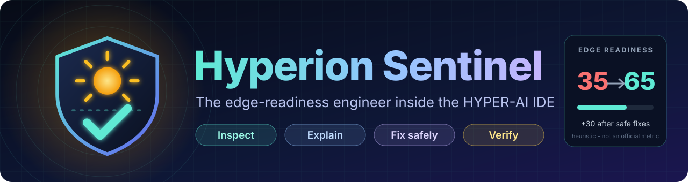
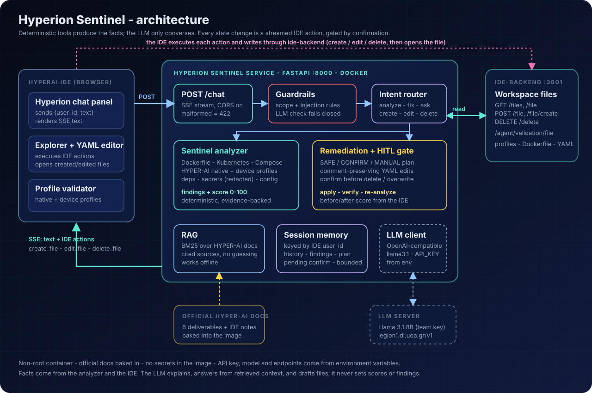
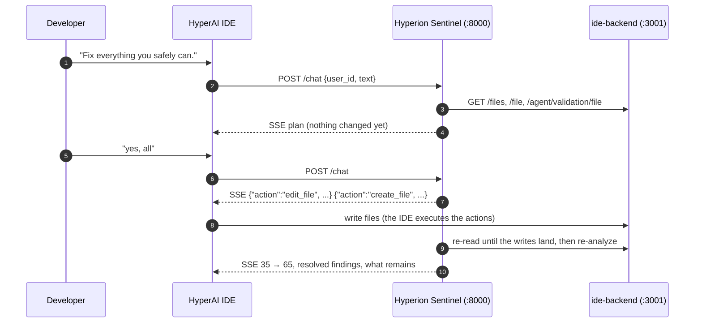

<p align="center">
  
</p>

<p align="center">
  <b>An agentic assistant for the HYPER-AI IDE that inspects your workspace, explains what blocks edge deployment,<br>fixes what is safe, asks before anything risky, and proves the improvement by re-reading the IDE.</b>
</p>

<p align="center">
  
  
  
  
  
</p>

## Important links

| What | Link |
|---|---|
| **Source code** (this repo) | [github.com/TusharTechs/hyperion-sentinel](https://github.com/TusharTechs/hyperion-sentinel) |
| **Docker image** (what the evaluator runs, `linux/amd64`) | [`tushartechs/hyperion:latest`](https://hub.docker.com/r/tushartechs/hyperion) |
| **Hackathon** - Veles Hack 2026 | [taikai.network/.../veles-hack-2026](https://taikai.network/en/eclipse-foundation/hackathons/veles-hack-2026/overview) |
| **Challenge 1 brief** - HYPER-AI / Hyperion | [Categories page](https://taikai.network/en/eclipse-foundation/hackathons/veles-hack-2026/categories) |
| **Official starter** this is built on | [gitlab.eclipse.org/.../hyperion-starter](https://gitlab.eclipse.org/eclipse-research-labs/hyper-ai-project/hyperion-starter) |
| **HYPER-AI project** | [hyper-ai-project.eu](https://hyper-ai-project.eu/) |
| **Live HyperAI IDE** / **tutorial** | [ide.hyperai.di.uoa.gr](https://ide.hyperai.di.uoa.gr/) · [ide-tutorial.hyperai.di.uoa.gr](https://ide-tutorial.hyperai.di.uoa.gr/) |
| **RAG knowledge base** (official HYPER-AI docs) | [`knowledge/`](knowledge/) |
| **Demo video** (2 min, recorded live in the real IDE with the real LLM) | [YouTube](https://youtu.be/7AZYCdE_vZU) · [mp4 in repo](docs/hyperion-sentinel-demo.mp4) · [subtitles](docs/hyperion-sentinel-demo.srt) |
| **Architecture diagram** | [`assets/architecture.svg`](assets/architecture.svg) |
| **Demo workspace** (deliberately imperfect app) | [`demo/hero/`](demo/hero/) |
| **Run the tests** | `uv run pytest -q` - see [Tests](#tests) |

## How it maps to the challenge criteria

The challenge states that submissions are scored **after the hackathon by running the Docker image** against these five expectations.

| # | Criterion | How Sentinel delivers | Where | Verified by |
|---|---|---|---|---|
| 1 | **Working agent**: `/chat`, answers HYPER-AI questions, turns language into **IDE actions** (writes the file *and opens it*) | FastAPI `POST /chat` on `:8000`, SSE increments + `create_file` / `edit_file` / `delete_file` actions the IDE executes | [`main.py`](main.py), [`hyperion/actions.py`](hyperion/actions.py) | real IDE run, `tests/test_api.py`, `tests/test_agent.py` |
| 2 | **Guardrails**: reject irrelevant queries | deterministic scope + prompt-injection rules; LLM only for ambiguous text and **fails closed**; refusals never touch files | [`hyperion/guard.py`](hyperion/guard.py) | `tests/test_guardrails.py` (15 off-topic / injection prompts) |
| 3 | **RAG**: ground answers in HYPER-AI docs | BM25 over paragraph chunks of the six official deliverables + IDE notes; answers cite sources; says "the documentation does not provide enough information" instead of guessing; works offline | [`hyperion/rag.py`](hyperion/rag.py), [`knowledge/`](knowledge/) | `tests/test_agent.py` |
| 4 | **Memory** across turns of a session | bounded per-`user_id` session: history, findings (so "fix the *second* issue" works), plan, pending confirmation, facts ("my name is…"), last file/image ("delete *it*") | [`hyperion/memory.py`](hyperion/memory.py) | `tests/test_memory_offline.py` |
| 5 | **Human-in-the-loop** (optional) for delete / overwrite | every delete, every overwrite of an existing file and every remediation plan waits for an explicit "yes"; "no" cancels; mass deletes refused | [`hyperion/agent.py`](hyperion/agent.py) | `tests/test_file_safety.py` |
| ★ | **Differentiator**: a real engineering agent, not a chatbot | the **Sentinel** analyzer + remediation engine (below) | [`hyperion/analyzer/`](hyperion/analyzer/), [`hyperion/remediation.py`](hyperion/remediation.py) | `tests/test_analyzer.py`, `tests/test_remediation.py`, `tests/test_hero_flow.py` |

It also keeps working when the evaluator runs the container **without an IDE backend** (it remembers the files it wrote, still confirms before deleting) and **without an LLM key** (deterministic features and documentation excerpts still answer).

## What Sentinel does

```text
"Prepare this application for edge deployment."
  → inspect workspace (through the IDE)  → analyze Docker · Kubernetes · Compose · HYPER-AI profiles · deps · secrets
  → Edge Readiness report (score + evidence)  → "what should I fix first?"
  → remediation plan: SAFE · needs your OK · manual   → you confirm
  → IDE actions apply the changes (files appear / open)  → re-read the workspace  → re-analyze
  → before → after score, what changed and why
```

A real transcript from the HYPER-AI IDE (condensed):

```text
You     Prepare this application for edge deployment.
Agent   EDGE READINESS REPORT      Edge Readiness: 35/100  (Sentinel's own heuristic - not an official HYPER-AI metric)
        17 findings: 3 HIGH · 7 MEDIUM · 7 LOW
         1. HIGH    Possible hardcoded secret                                  [.env:2]            (manual)
         2. HIGH    Deployment/sensor-api is missing resource requests/limits  [deployment.yaml:16] (safe fix)
         3. HIGH    Deployment/sensor-api has no readinessProbe                [deployment.yaml:16] (safe fix)
         4. MEDIUM  Base image is not pinned (uses `latest`)                   [Dockerfile:1]      (safe fix)
        I can fix 7 safely, 5 need your confirmation, and 5 are manual.
You     Fix everything you safely can.
Agent   REMEDIATION PLAN - Safe changes ✓ … Requires confirmation ⚠ … Manual • …   Nothing has been changed yet.
You     yes, all
Agent   Applying 4 changes in the IDE … Verifying with the IDE… verified.
        Edge Readiness: 35/100 → 65/100   (+30 improvement)      Resolved (12): ✓ …      Still open: 5 (manual)
You     What changed and why?
Agent   Edited Dockerfile: `FROM python:latest` → `python:3.12-slim`, added HEALTHCHECK, USER 10001 …
```

### The Sentinel analyzer (deterministic - the LLM never invents findings or the score)

| Area | Checks (each with file, line, evidence, why it matters, fix, automation safety) |
|---|---|
| **Dockerfile** | `latest`/untagged base, full-size base, root user, missing `HEALTHCHECK`, `apt` recommends/cache, `pip` cache, compilers in single-stage builds, missing `.dockerignore`, secrets in `ENV` |
| **Kubernetes** | CPU/memory requests & limits, readiness/liveness probes, privileged, `hostNetwork`/`hostPID`/`hostIPC`, `runAsNonRoot`, unpinned images, replica count, placement hints, Service type; multi-document YAML |
| **Docker Compose** | unpinned images, restart policy, resource limits, healthcheck, privileged, host mounts, external networks, hardcoded credentials |
| **HYPER-AI profiles** | native + device application profiles: unpinned images, public ports, missing arm64, oversized requests, plain-HTTP artifacts, missing checksums - plus the **IDE's own validator** (`/api/agent/validation/file`) folded into the report |
| **Dependencies** | unpinned / ranged versions, dev tools in production, heavy and native-build packages, dependency count (`requirements*.txt`, `package.json`) |
| **Config & secrets** | hardcoded secrets (**never printed**: evidence shows `KEY=<redacted>`), hardcoded external URLs, `.env` without `.env.example` |
| **Completeness** | missing Dockerfile, deployment manifest, README, dependency manifest |

**Score** = 100 − penalties (CRITICAL 25 · HIGH 15 · MEDIUM 7 · LOW 3); repeats of one rule count 100 / 50 / 25 %, each severity tier is capped (50 / 36 / 20 / 9). It is **Sentinel's own heuristic, not an official HYPER-AI metric or a certification.** Unknown images are never auto-pinned: pinning is only offered for a table of well-known images.

**Remediation** edits YAML with comment-preserving round-trips, edits Dockerfiles minimally, re-parses every result before offering it, and is idempotent. Findings are tagged `SAFE_AUTO`, `CONFIRM_REQUIRED` or `MANUAL_ONLY`; a risky change is never made because a model suggested it.

## Architecture

<p align="center"></p>



### The IDE protocol (reverse-engineered - the starter does not document it)

* The chat panel `POST`s `{user_id, text}` to `http://localhost:8000/chat` and reads SSE `data:` events.
* An event whose JSON has an **`action`** key is executed by the IDE instead of shown: `create_file` (writes **and opens it in the editor**; fails if it exists), `edit_file` (overwrite + open), `delete_file`, `create_folder`, `delete_folder`, `write_yaml_to_editor`. Text goes in `{"response": "<increment>"}`; `data: [DONE]` ends the stream.
* The IDE performs file writes itself through `ide-backend`, asynchronously - so Hyperion polls the backend until the writes land before re-analyzing.
* The workspace is the backend's `helm-charts/` tree, read with `GET /api/files` and `GET /api/file`.

## Project structure

```text
hyperion-sentinel/
├── main.py                    FastAPI app: POST /chat (SSE), GET /health, CORS (starter contract preserved)
├── helpers.py                 starter helpers: read_file, validate_file (IDE backend)
├── hyperion/
│   ├── agent.py               intent routing, HITL confirmations, conversation memory, Q&A
│   ├── guard.py               scope + prompt-injection guardrails (fail closed)
│   ├── rag.py                 BM25 retrieval over knowledge/
│   ├── memory.py              bounded per-user_id sessions
│   ├── actions.py             SSE framing + IDE action events
│   ├── workspace.py           IDE backend reader, path-safety (traversal, absolute, hidden…)
│   ├── remediation.py         comment-preserving fixes, file changes
│   ├── render.py              report / plan / explanation text (all numbers from the analyzer)
│   ├── templates.py           deterministic nginx/redis/… Deployment + Compose generators
│   ├── llm.py                 OpenAI-compatible client; failures degrade gracefully
│   ├── models.py              Finding model + deterministic score
│   ├── config.py              environment configuration
│   └── analyzer/              engine + rules: docker, k8s, compose, profile, deps, config
├── knowledge/                 official HYPER-AI docs (.docx sources + cleaned .md used for RAG)
├── tests/                     203 tests: API, guardrails, safety, analyzer, remediation, agent, memory
├── demo/                      hero workspace, seed_workspace.py, analyze_dir.py
├── scripts/                   build_knowledge.py (docx → md), make_slides.py, record_demo.py, assemble_video.py
├── assets/                    logo, banner, architecture diagram, slides
├── docs/                      demo video + subtitles, Taikai and Docker Hub texts
├── Dockerfile · docker-compose.yaml · .env.example
```

## Run it

```bash
# 1. The IDE (macOS: port 5000 is AirPlay - serve the GUI elsewhere, e.g. 5050:80)
docker run --rm -p 3001:3001 -e AUTH_ENABLED=false --name ide-backend donmichael/ide-backend:latest
docker run --rm -p 5050:80 --name ide-gui donmichael/ide-gui:latest        # Apple Silicon: add --platform linux/amd64

# 2. LLM key (from the HyperAI organizers) - never commit it
cp .env.example .env     # set API_KEY=...

# 3. Hyperion
uv run main.py           # or: docker compose up --build

# 4. Load the imperfect demo app into the IDE (folder `demo/`) and open http://localhost:5050
uv run python demo/seed_workspace.py
```

Open **Hyperion** from the robot icon in the IDE sidebar. Without the IDE:

```bash
curl -N -X POST http://localhost:8000/chat -H "Content-Type: application/json" \
  -d '{"user_id": "123e4567-e89b-12d3-a456-426614174000", "text": "What is HyperAI?"}'
uv run python demo/analyze_dir.py demo/hero      # the analyzer on a local folder
```

### Configuration

| Variable | Default | Meaning |
|---|---|---|
| `API_KEY` | *(none)* | key for the OpenAI-compatible LLM server - **never baked into the image** |
| `LLM_BASE_URL` | `https://legion1.di.uoa.gr/v1` | endpoint (Ollama: `http://host.docker.internal:11434/v1`) |
| `LLM_MODEL` | `llama3.1` | model |
| `LLM_TIMEOUT` | `60` | seconds per LLM call |
| `IDE_BACKEND_URL` | `http://localhost:3001/api` (image: `http://host.docker.internal:3001/api`) | IDE backend |

### Docker

```bash
docker run --rm -p 8000:8000 -e API_KEY=... --add-host host.docker.internal:host-gateway tushartechs/hyperion:latest
```

Multi-stage, **non-root** (uid 10001), `HEALTHCHECK`, listens on `0.0.0.0:8000`, docs baked in. Build an **amd64** image for evaluation (`docker buildx build --platform linux/amd64 -t <user>/hyperion:latest --push .`). Behind a TLS-inspecting proxy, copy your CA bundle to `./ca-bundle.pem` before building - it is used only in the throwaway builder stage and is `.gitignore`d.

## Tests

```bash
uv run pytest -q      # 203 tests
```

They run the whole agent against a simulated IDE (`tests/conftest.py: FakeIDE`) that executes SSE actions like the real IDE, including a laggy mode and an unreachable-backend mode. LLM calls are faked. Coverage: valid / malformed / missing-field requests, SSE framing, LLM failure and timeout, off-topic and injection prompts, path traversal, malformed YAML, large files, empty workspace, every finding type, remediation idempotence, HITL (confirm / cancel / mass-delete refusal), "fix the second issue", "what did you change?", and name/file memory.

## Demo (2–3 minutes)

Reset with `uv run python demo/seed_workspace.py`, reload the IDE, open Hyperion:

1. `Prepare this application for edge deployment.` - report with score and numbered findings.
2. `What should I fix first?` - top findings with evidence and why.
3. `Fix everything you safely can.` - plan; nothing changed yet.
4. `yes, all` - files change in the explorer, `deployment.yaml` opens, verified re-read, **before → after score**.
5. `What changed and why?`
6. Bonus: `Create a deployment YAML for a service using the nginx Docker image` · `delete it` → confirm · `What is the Application Profile Manager?` · `What is the weather today?`

## Known limitations

* Findings and score are heuristics over files in the workspace; Sentinel does not deploy to or inspect real edge nodes.
* Confirmation is conversational because the IDE protocol has no confirm event.
* Free-form file generation/edits and RAG answers depend on the quality of the 8B model; edits are always diffed and confirmed first.
* Image pinning uses a small table of conservative tags, not a registry lookup.
* RAG grounding is the six official deliverable summaries plus short IDE notes - that is all the documentation provided.

## Credits & license

Built on the official [`hyperion-starter`](https://gitlab.eclipse.org/eclipse-research-labs/hyper-ai-project/hyperion-starter) by the HYPER-AI project (Eclipse Research Labs), for **Veles Hack 2026, Challenge 1**. Licensed under [Apache 2.0](LICENCE).
